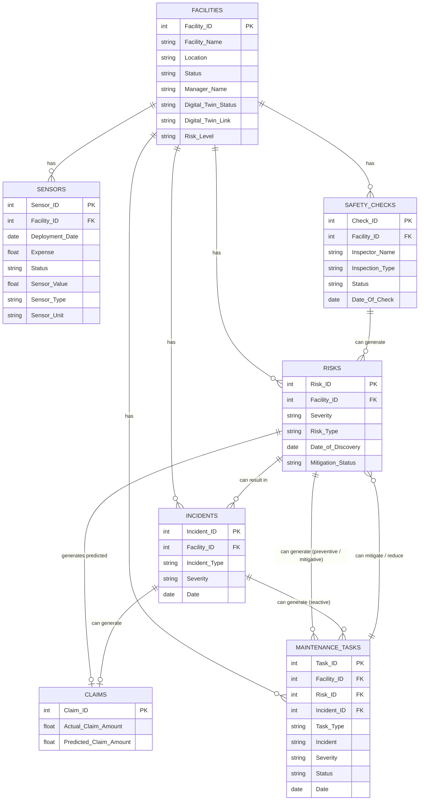

# Database Relational Diagram

This document details the structure and relationships of the entities within the **Facility Management Database**.

## Database Relational Diagram

## Entities Summary

| Entity               | Primary Key (PK) | Foreign Key (FK)                  | Description                                                                                    |
| -------------------- | ---------------- | --------------------------------- | ---------------------------------------------------------------------------------------------- |
| **SENSORS**          | sensor_id        | facility_id (links to Facilities) | Stores sensor details, including type, installation date, and operational status.              |
| **FACILITIES**       | facility_id      | -                                 | Information about each facility, including location, manager, and digital twin status.         |
| **ALERTS**           | alert_id         | facility_id, sensor_id            | Tracks alerts generated by sensors, linked to specific facilities.                             |
| **RISKS**            | risk_id          | facility_id                       | Information on identified risks, including type, impact level, and resolution status.          |
| **ACTIONS**          | action_id        | risk_id                           | Describes actions taken to address risks, including action type and description.               |
| **CLAIMS**           | claim_id         | -                                 | Holds claim-related data, including predicted and actual claim values.                         |
| **SAFETYCHECKS**     | check_id         | facility_id                       | Records safety inspections, detailing inspector, type, and result status.                      |
| **MAINTENANCETASKS** | task_id          | risk_id, facility_id              | Details maintenance tasks performed to address risks, including severity and status.           |
| **INCIDENTS**        | incident_id      | facility_id                       | Documents incidents at facilities, including severity and status.                              |
| **SENSORDATA**       | -                | sensor_id                         | Sensor data logs, recording values like humidity, temperature, and CO2 at specific timestamps. |
| **ANOMALIES**        | anomaly_id       | sensor_id                         | Stores details of detected anomalies in sensor data, including type and timestamp.             |
| **EXPENSES**         | expense_id       | sensor_id                         | Logs expenses associated with sensors, including expense amount and date.                      |
| **SAVINGS**          | savings_id       | sensor_id                         | Tracks savings generated by sensors, including savings amount and date.                        |

## Entity Attributes

### SENSORS

- **sensor_id** (PK): Unique identifier for each sensor.
- **facility_id** (FK): Links to the facility where the sensor is installed.
- **sensor_type**: Type of sensor.
- **installation_date**: Date of installation.
- **status**: Operational status of the sensor.

### FACILITIES

- **facility_id** (PK): Unique identifier for each facility.
- **facility_name**: Name of the facility.
- **location**: Location of the facility.
- **status**: Operational status.
- **manager_name**: Manager responsible.
- **last_inspection_date**: Date of last inspection.
- **digital_twin_status**: Status of the digital twin.

### ALERTS

- **alert_id** (PK): Unique identifier for each alert.
- **status**: Current alert status.
- **facility_id** (FK): Linked facility.
- **sensor_id** (FK): Sensor that triggered the alert.

### RISKS

- **risk_id** (PK): Unique identifier.
- **risk_type**: Category/type.
- **facility_id** (FK): Affected facility.
- **status**: Status of the risk.
- **impact_level**: Severity level.
- **date_reported**: Date identified.
- **date_addressed**: Date resolved (if applicable).

### ACTIONS

- **action_id** (PK): Unique identifier.
- **risk_id** (FK): Linked risk.
- **action_type**: Type of action.
- **action_description**: Detailed description.
- **action_date**: Date performed.

### CLAIMS

- **claim_id** (PK): Unique identifier.
- **predicted_claim**: Estimated amount.
- **actual_claim**: Actual amount processed.
- **claim_without_parametriks**: Unadjusted claim.
- **claim_month**: Month pertaining to claim.

### SAFETYCHECKS

- **check_id** (PK): Unique identifier.
- **inspector_name**: Inspector name.
- **inspection_type**: Type of inspection.
- **status**: Result status.
- **facility_id** (FK): Facility inspected.

### MAINTENANCETASKS

- **task_id** (PK): Unique identifier.
- **risk_id** (FK): Associated risk.
- **incident**: Prompting incident.
- **severity**: Incident severity.
- **status**: Current status.
- **date**: Date of the task.
- **facility_id** (FK): Facility where task occurred.

### INCIDENTS

- **incident_id** (PK): Unique identifier.
- **incident**: Description.
- **severity**: Incident severity.
- **status**: Current status.
- **date**: Occurrence date.
- **facility_id** (FK): Facility affected.

### SENSORDATA

- **sensor_id** (FK): Associated sensor.
- **timestamp**: Data capture time.
- **humidity**: Humidity level.
- **temperature**: Temperature reading.
- **CO2**: CO2 level.

### ANOMALIES

- **anomaly_id** (PK): Unique identifier.
- **sensor_id** (FK): Sensor detecting anomaly.
- **anomaly_type**: Type of anomaly.
- **timestamp**: Detection time.

### EXPENSES

- **expense_id** (PK): Unique identifier.
- **sensor_id** (FK): Related sensor.
- **expense_amount**: Cost amount.
- **expense_date**: Date incurred.

### SAVINGS

- **savings_id** (PK): Unique identifier.
- **sensor_id** (FK): Related sensor.
- **savings_amount**: Amount saved.
- **savings_date**: Date recorded.

## Relationships Overview

