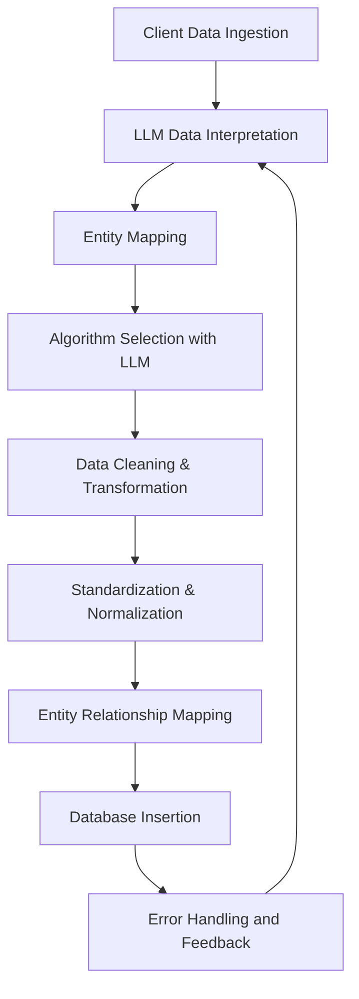

# Backend Structure

The **PARAMETRIKS** backend is built on AWS to provide a secure, scalable, and high-performance environment for managing IoT and insurance data. This document outlines the key components, machine learning-driven data transformation processes, and infrastructure for security, scalability, and disaster recovery.

## AWS-Powered Architecture

PARAMETRIKS leverages a comprehensive AWS infrastructure to handle data ingestion, processing, and storage needs. The AWS architecture provides flexibility, performance, and security, using the following core components:

- **Compute Resources**:

  - **EC2 Instances**: Used for intensive data processing.
  - **Lambda Functions**: Enable event-driven tasks to handle real-time updates and notifications.

- **Data Storage**:

  - **Amazon RDS**: Manages relational data with high availability and durability.
  - **Amazon S3**: Stores raw data files, supporting large volumes of data with low latency.

- **Networking & Content Delivery**:

  - **CloudFront**: Delivers content securely with low latency for enhanced user experience.

- **Monitoring & Logging**:
  - **CloudWatch**: Provides insights into system health and performance metrics.
  - **CloudTrail**: Tracks API activity, supporting security compliance and auditing.

## Machine Learning-Assisted Data Transformation for Insurance Platform

PARAMETRIKS utilizes machine learning algorithms and Large Language Models (LLMs) to transform and standardize client-provided insurance data into structured formats for seamless integration and analysis.

### Overview

Insurance data from clients often arrives in unstructured or varied formats, typically CSV files with accompanying metadata. This necessitates a flexible, automated process for understanding, transforming, and integrating data.

**Transformation Objectives**:

1. **Data Understanding**: LLMs interpret the structure, labels, and descriptions in client data files.
2. **Algorithm Selection**: LLMs recommend transformation algorithms based on insurance and statistical knowledge.
3. **Data Standardization**: Transform data into a unified schema aligned with the **Database Relational Diagram**.
4. **Integration**: Store transformed data in the platform’s database for predictive analytics and insights.

### Transformation Process

The data transformation process consists of several steps to ensure accuracy, consistency, and readiness for integration.

 

#### Step 1: Data Ingestion

- **Format Compatibility**: Supports data ingestion in various formats, including CSV and Excel.
- **Initial Storage**: Stores raw data securely for processing, ensuring it remains accessible and protected.

#### Step 2: Data Interpretation Using LLM

- **Schema Analysis**: Uses natural language processing (NLP) to interpret schema details, column headers, and descriptions.
- **Entity Mapping**: Maps data fields to predefined entities in the **Database Relational Diagram**, such as `FACILITIES`, `SENSORS`, or `RISKS`.

#### Step 3: Algorithm Selection

- The LLM recommends suitable machine learning algorithms to streamline transformation:
  - **Data Cleaning**: Identifies and corrects inconsistencies (e.g., missing values, outliers).
  - **Normalization and Standardization**: Aligns numerical and categorical data with the platform’s schema.
  - **Text Classification**: Organizes unstructured text into predefined categories (e.g., `risk_type` in `RISKS`).
  - **Anomaly Detection**: Flags data anomalies, mapping them to `ANOMALIES` for further analysis.

#### Step 4: Data Transformation

- **Mapping and Standardization**: Transforms raw data into a schema-compliant format.
- **Entity Relationships**: Establishes links between entities (e.g., `SENSORS` to `FACILITIES`) based on the relational model.

#### Step 5: Database Insertion

- **Schema Compliance**: Inserts transformed data into the database in alignment with predefined schemas.
- **Error Handling**: Logs inconsistencies encountered during insertion for future review.

#### Step 6: Continuous Learning

- Feedback from data analysts continuously refines the machine learning models, improving accuracy and efficiency for future transformations.

### Benefits of Machine Learning Integration

- **Automated Data Understanding**: LLMs simplify onboarding by automatically interpreting schemas and data descriptions.
- **Intelligent Transformation**: LLM-driven algorithm recommendations improve efficiency and accuracy.
- **Enhanced Data Integrity**: Reduces manual errors, ensuring data consistency.
- **Scalability**: The platform adapts to varied data formats from multiple clients, enhancing scalability.

## Security & Authentication

Security is a cornerstone of PARAMETRIKS’ backend architecture. The platform employs AWS Identity and Access Management (IAM) and multi-factor authentication (MFA) for robust access control.

### Key Security Features

- **Role-Based Access Control**: IAM roles restrict access to sensitive data, ensuring only authorized users and services can interact with critical resources.
- **Multi-Factor Authentication (MFA)**: MFA adds an additional layer of security, protecting against unauthorized access.
- **Data Encryption**: AWS services provide end-to-end encryption for both data at rest and in transit.

## Scalability and Disaster Recovery

To ensure high availability and resilience, PARAMETRIKS incorporates AWS autoscaling and disaster recovery solutions.

### Scalability

- **Autoscaling Groups**: Automatically adjusts compute resources based on demand, ensuring optimal performance without manual intervention.

### Disaster Recovery

- **Automated Backups**: Regular data backups safeguard against data loss and allow for easy restoration if needed.
- **Cross-Region Replication**: Replicates critical data across AWS regions to maintain availability during regional outages, providing robustness against potential failures.

## Summary

The PARAMETRIKS backend leverages AWS infrastructure to deliver a high-performance, secure, and scalable platform. By integrating machine learning for data transformation, AWS for compute and storage, and robust security measures, PARAMETRIKS offers an innovative and resilient solution for the insurance industry. This AWS-powered architecture, combined with machine learning-driven insights, allows for seamless data ingestion, transformation, and integration, providing clients with real-time analytics and predictive insights.
