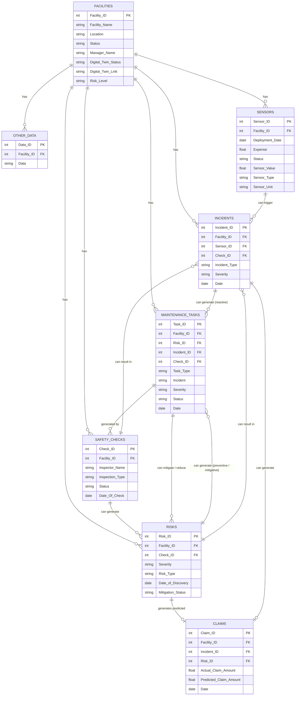

# Database Schema

This document provides an overview of the database schema for the system, including descriptions of each entity and its properties, a relational database diagram, and a summary table of the components, required data, retrieval methods, and any necessary calculations. Additionally, this platform has the flexibility to integrate further data sources for enhanced functionality.

## Future Data Sources

As the platform evolves, integrating additional data sources could enrich analytics, improve operational insights, and support more advanced forecasting. Potential data sources include:

1. **Weather and Environmental Data**  
   Integrating real-time weather and environmental data could enhance sensor analysis (e.g., correlating temperature and humidity with facility data), allowing for predictive maintenance in response to environmental factors.

2. **Historical Claims Data**  
   External claims data could provide more accuracy in predictive modeling by enabling the platform to benchmark and identify claim trends across different types of facilities or regions.

3. **Financial Data**  
   Including financial data sources (e.g., operating costs, utility expenses) could enable more detailed analyses, such as cost-saving projections from risk mitigation efforts or sensor-based efficiency.

4. **Asset Health Monitoring**  
   Integrating data from IoT systems dedicated to asset monitoring (e.g., HVAC systems, electrical infrastructure) would allow for deeper insights into asset-specific risks, predictive maintenance needs, and operational longevity.

5. **Energy Consumption Data**  
   Data on energy consumption could be linked with sensor data and facility operations, supporting analyses on energy savings, efficiency, and the impact of maintenance tasks on consumption.

## Entity Descriptions

### 1. **Facilities**

> Represents facilities monitored by the system.

- **Facility_ID**: Unique identifier for each facility (Primary Key).
- **Facility_Name**: Name of the facility.
- **Location**: Geographic location or area of the facility.
- **Status**: Operational status of the facility (closed, maintenance, operational).
- **Manager_Name**: Name of the facility's manager.
- **Digital_Twin_Status**: Indicates whether a digital twin exists (true, false).
- **Digital_Twin_Link**: Link to the facility's digital twin (if applicable).
- **Risk_Level**: Overall risk level of the facility (none, low, medium, high).

### 2. **Sensors**

> Stores information about sensors deployed in facilities.

- **Sensor_ID**: Unique identifier for each sensor (Primary Key).
- **Facility_ID**: Identifier linking the sensor to a facility (Foreign Key).
- **Deployment_Date**: Date when the sensor was deployed.
- **Expense**: Cost associated with the sensor.
- **Status**: Current operational status of the sensor (true, false).
- **Sensor_Value**: Most recent reading value from the sensor.
- **Sensor_Type**: Type/category of the sensor.
- **Sensor_Unit**: Measurement unit of the sensor (e.g., Celsius, Fahrenheit, ppm, Percentage).

### 3. **Risks**

> Details risks identified within each facility.

- **Risk_ID**: Unique identifier for each risk (Primary Key).
- **Facility_ID**: Identifier linking the risk to a facility (Foreign Key).
- **Severity**: Severity level of the risk (low, medium, high).
- **Risk_Type**: Type or category of the risk (e.g., fire, plumbing, ac).
- **Date_of_Discovery**: Date the risk was identified.
- **Mitigation_Status**: Status of the risk mitigation (not mitigated, mitigating, mitigated, avoided).

### 4. **Claims**

> Stores information about claims filed due to risks or incidents.

- **Claim_ID**: Unique identifier for each claim (Primary Key).
- **Actual_Claim_Amount**: Actual claim amount filed.
- **Predicted_Claim_Amount**: Predicted claim amount for forecasting.
- **Date**: Date of the claim submission.

### 5. **Incidents**

> Records incidents that occur within facilities.

- **Incident_ID**: Unique identifier for each incident (Primary Key).
- **Facility_ID**: Identifier linking the incident to a facility (Foreign Key).
- **Incident_Type**: Type or category of the incident (e.g., fire, water leak).
- **Severity**: Severity level of the incident (low, medium, high).
- **Date**: Date the incident occurred.

### 6. **Safety Checks**

> Tracks safety checks conducted within facilities.

- **Check_ID**: Unique identifier for each safety check (Primary Key).
- **Facility_ID**: Identifier linking the safety check to a facility (Foreign Key).
- **Inspector_Name**: Name of the inspector conducting the check.
- **Inspection_Type**: Type or category of the inspection.
- **Status**: Status of the safety check (not done, in progress, completed, skipped).
- **Date_Of_Check**: Date the safety check was performed.

### 7. **Maintenance Tasks**

> Logs maintenance tasks related to risks or incidents within facilities.

- **Task_ID**: Unique identifier for each maintenance task (Primary Key).
- **Facility_ID**: Identifier linking the task to a facility (Foreign Key).
- **Risk_ID**: Identifier linking the task to a risk (Foreign Key).
- **Incident_ID**: Identifier linking the task to an incident (Foreign Key).
- **Task_Type**: Type or category of the task.
- **Incident**: Incident linked to the task.
- **Severity**: Severity level of the maintenance task (low, medium, high).
- **Status**: Current status of the task (not done, in progress, completed, skipped).
- **Date**: Date the task was scheduled or completed.

## Database Relational Diagram

## Component Summary Table

| **Component**                                    | **Data Required**                                                                    | **Retrieval Method**                        | **Calculation (if required)**                                                                                                |
| ------------------------------------------------ | ------------------------------------------------------------------------------------ | ------------------------------------------- | ---------------------------------------------------------------------------------------------------------------------------- |
| **Card: Numbers of Sensors Deployed**            | - Number of Sensors Last Month - Number of Sensors This Month                     | Calculated                                  | Count `Sensor_ID` per `Facility_ID` filtered by deployment month                                                             |
| **Card: Number of Facilities Serviced**          | - Facilities Serviced Last Month - Facilities Serviced This Month                 | Calculated                                  | Count `Facility_ID` with `Status = Operational` by month                                                                     |
| **Card: Pending Alerts to Review**               | - Alerts with Status Pending                                                         | Calculated from `RISKS`                     | Count `Risk_ID` where `Mitigation_Status = Unaddressed`                                                                      |
| **Card: Risks Addressed This Week**              | - Risks Addressed This Week                                                          | Calculated                                  | Count `Risk_ID` where `Mitigation_Status = Addressed` within the current week                                                |
| **Chart: Risks VS Actions**                      | - Number of Risks - Number of Actions - Month                                  | Calculated                                  | Count `Risk_ID` and associated `MAINTENANCE_TASKS` by month                                                                  |
| **Chart: Claims**                                | - Predicted Claims - Actual Claims - Month                                     | Calculated                                  | Count `Claim_ID` where `Actual_Claim_Amount != 0` (Actual Claims) and `Actual_Claim_Amount == 0` (Predicted Claims) by month |
| **Chart: (Risks) Avoided VS Mitigated**          | - Risks Avoided - Risks Mitigated - Month                                      | Calculated                                  | Count `Risk_ID` where `Mitigation_Status` is `Avoided` or `Mitigated`, grouped by month                                      |
| **Chart: Trend of Inbound Sensor Data**          | - Sensor Data (Value, Type, Unit) - Time                                          | Directly Retrieved from `SENSORS`           | N/A                                                                                                                          |
| **Chart: Monthly Claim Amount Saved ($)**        | - Monthly Claim Amount Saved - Month                                              | Calculated                                  | Sum (`Predicted_Claim_Amount` - `Actual_Claim_Amount`) by month                                                              |
| **Chart: Monthly Anomaly Trend**                 | - Total Number of Anomalies - Month                                               | Calculated                                  | Count of `Incident_ID` by month where anomalies are flagged                                                                  |
| **Chart: Sensor Savings VS Expenses**            | - Savings per Sensor - Expenses per Sensor                                        | Calculated                                  | For each sensor, compute `Predicted_Claim_Amount - Actual_Claim_Amount` vs `Expense`                                         |
| **Chart: Number of Sensor Kit in Each Facility** | - Number of Sensors in each Facility                                                 | Calculated                                  | Count `Sensor_ID` per `Facility_ID`                                                                                          |
| **Table: Recent Safety Checks**                  | - Inspector Name - Inspection Type - Status                                    | Directly Retrieved from `SAFETY_CHECKS`     | N/A                                                                                                                          |
| **Table: Facilities**                            | - Facility Name - Location - Status - Manager Name - Digital Twin Status | Directly Retrieved from `FACILITIES`        | N/A                                                                                                                          |
| **Table: Maintenance Tasks**                     | - Task Type - Incident - Severity - Status - Date - Facility          | Directly Retrieved from `MAINTENANCE_TASKS` | N/A                                                                                                                          |
| **Table: Recent Incidents**                      | - Incident Type - Severity - Status - Date - Facility                    | Directly Retrieved from `INCIDENTS`         | N/A                                                                                                                          |
| **Chart: Risk Distribution**                     | - Number of Risk - Type of Risk                                                   | Calculated                                  | Group `Risk_ID` by `Risk_Type` and count                                                                                     |
