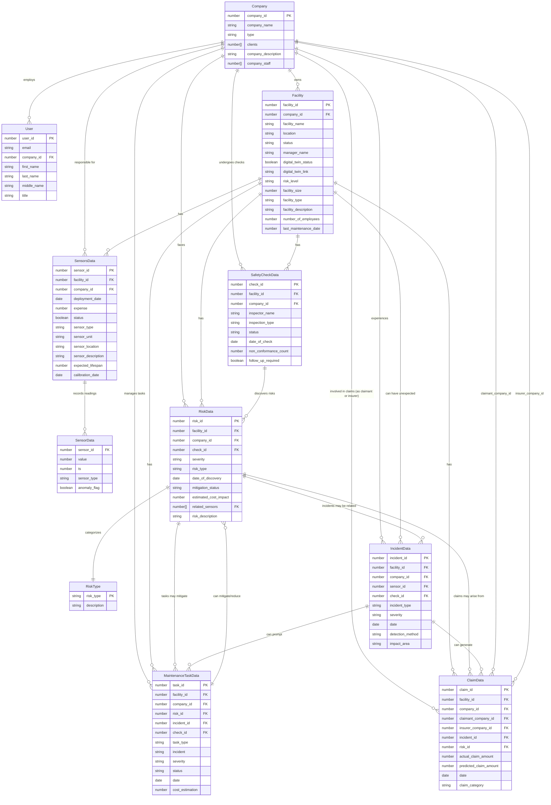

# Database Schema

This document provides an overview of the database schema for the system, including descriptions of each entity and its properties, a relational database diagram, and a summary table of the components, required data, retrieval methods, and any necessary calculations. Additionally, this platform has the flexibility to integrate further data sources for enhanced functionality.

## Future Data Sources

As the platform evolves, integrating additional data sources could enrich analytics, improve operational insights, and support more advanced forecasting. Potential data sources include:

1. **Weather and Environmental Data**  
   Integrating real-time weather and environmental data could enhance sensor analysis (e.g., correlating temperature and humidity with facility data), allowing for predictive maintenance in response to environmental factors.

2. **Historical Claims Data**  
   External claims data could provide more accuracy in predictive modeling by enabling the platform to benchmark and identify claim trends across different types of facilities or regions.

3. **Financial Data**  
   Including financial data sources (e.g., operating costs, utility expenses) could enable more detailed analyses, such as cost-saving projections from risk mitigation efforts or sensor-based efficiency.

4. **Asset Health Monitoring**  
   Integrating data from IoT systems dedicated to asset monitoring (e.g., HVAC systems, electrical infrastructure) would allow for deeper insights into asset-specific risks, predictive maintenance needs, and operational longevity.

5. **Energy Consumption Data**  
   Data on energy consumption could be linked with sensor data and facility operations, supporting analyses on energy savings, efficiency, and the impact of maintenance tasks on consumption.

Below is the updated markdown reflecting the new schema with the **Company** and **User** entities, as well as the updated associations to `company_id` across all entities and the additional fields for **Claim Data**.

## Entity Descriptions

### 1. **Company**

> The **Company** entity represents an organization, which can be either a client or an insurer. Insurers may have a list of client companies they insure, and both types have associated staff (users).

- **company_id**: Unique identifier for the company (Primary Key).
- **company_name**: Name of the company.
- **type**: Company type, either `insurer` or `client`.
- **clients**: An array of company IDs representing the clients if this company is an insurer. Optional field.
- **company_description**: A brief description of the company.
- **company_staff**: An array of user IDs representing the staff (users) associated with this company.

### 2. **User**

> The **User** entity contains information about users who are associated with a company. Each user belongs to exactly one company.

- **user_id**: Unique identifier for the user (Primary Key).
- **email**: The user’s email address.
- **company_id**: Identifier linking the user to a specific company (Foreign Key).
- **first_name**: The user’s first name.
- **last_name**: The user’s last name.
- **middle_name**: The user’s middle name (optional).
- **title**: A salutation or title, such as `Mr`, `Mrs`, `Dr`, or `Mdm`.

### 3. **Facilities**

> The **Facilities** entity holds information about the various facilities managed, such as warehouses or distribution centers. Facilities belong to a **client** company.

- **facility_id**: Unique identifier for each facility (Primary Key).
- **facility_name**: The name of the facility.
- **company_id**: Identifier linking the facility to the company that owns it (Foreign Key; must be a client company).
- **location**: Geographical location of the facility.
- **status**: Current operational status of the facility (`closed`, `maintenance`, `operational`).
- **manager_name**: Name of the manager in charge of the facility.
- **digital_twin_status**: Boolean indicating if a digital twin exists for the facility.
- **digital_twin_link**: URL linking to the digital twin resource of the facility.
- **risk_level**: Current risk level of the facility (`none`, `low`, `medium`, `high`).
- **facility_size**: Size of the facility in square meters.
- **facility_type**: Type of the facility (e.g., `Warehouse`).
- **facility_description**: Description of the facility.
- **number_of_employees**: Number of employees working at the facility.
- **last_maintenance_date**: Unix timestamp of the last maintenance activity.

### 4. **Sensors Data**

> The **Sensors Data** entity stores information about sensors deployed at facilities. Each sensor is associated with a facility and a company.

- **sensor_id**: Unique identifier for each sensor (Primary Key).
- **facility_id**: Identifier linking the sensor to a specific facility (Foreign Key).
- **company_id**: Identifier linking the sensor to the same company as the facility (Foreign Key).
- **deployment_date**: Unix timestamp or date of when the sensor was deployed.
- **expense**: Cost incurred for the sensor in dollars.
- **status**: Boolean indicating the operational status of the sensor.
- **sensor_type**: Type of the sensor (e.g., `Temperature Sensor`).
- **sensor_unit**: Unit in which the sensor measures (e.g., `Celsius`).
- **sensor_location**: Specific location within the facility where the sensor is installed.
- **sensor_description**: Additional information describing the purpose of the sensor.
- **expected_lifespan**: Expected lifespan of the sensor in months.
- **calibration_date**: Unix timestamp or date of the last calibration.

### 5. **Sensor Data**

> The **Sensor Data** entity contains time-series data collected from sensors.

- **value**: Recorded value from the sensor.
- **ts**: Unix timestamp when the data was recorded.
- **sensor_id**: Unique identifier for the sensor that generated the data (Foreign Key).
- **sensor_type**: Type of the sensor that provided the value.
- **anomaly_flag**: Boolean indicating if the data value is anomalous.

### 6. **Risk Data**

> The **Risk Data** entity captures identified risks in facilities, including severity and mitigation information.

- **risk_id**: Unique identifier for each risk (Primary Key).
- **facility_id**: Identifier linking the risk to a specific facility (Foreign Key).
- **company_id**: Identifier linking the risk to the company that owns the facility (Foreign Key).
- **check_id**: Identifier for a related safety check, if applicable.
- **severity**: Severity level of the risk (`low`, `medium`, `high`).
- **risk_type**: Type of risk identified (e.g., `Fire Hazard`).
- **date_of_discovery**: Unix timestamp or date of when the risk was discovered.
- **mitigation_status**: Status of mitigation (`not mitigated`, `mitigating`, `mitigated`, `avoided`).
- **estimated_cost_impact**: Estimated financial impact of the risk in dollars.
- **related_sensors**: Array of sensor IDs related to the risk.
- **risk_description**: Description of the risk.

### 7. **Risk Type**

> The **Risk Type** entity contains standardized risk types.

- **risk_type**: Name of the risk type (Primary Key).
- **description**: Description of the risk type.

### 8. **Claim Data**

> The **Claim Data** entity tracks claims made due to incidents or risks. Each claim involves a claimant (client company) and an insurer company.

- **claim_id**: Unique identifier for each claim (Primary Key).
- **facility_id**: Identifier linking the claim to a specific facility (Foreign Key).
- **company_id**: Identifier linking the claim to the company that owns the facility (Foreign Key; typically the claimant’s company).
- **claimant_company_id**: Identifier of the company making the claim (Foreign Key; must be a client company).
- **insurer_company_id**: Identifier of the insurer company handling the claim (Foreign Key; must be an insurer company).
- **incident_id**: Identifier linking the claim to a specific incident, if applicable.
- **risk_id**: Identifier linking the claim to a specific risk, if applicable.
- **actual_claim_amount**: Actual amount claimed in dollars.
- **predicted_claim_amount**: Predicted claim amount in dollars.
- **date**: Unix timestamp or date of the claim.
- **claim_category**: Category of the claim (e.g., `Property Damage`).

### 9. **Incident Data**

> The **Incident Data** entity contains information about incidents that occurred at facilities.

- **incident_id**: Unique identifier for each incident (Primary Key).
- **facility_id**: Identifier linking the incident to a specific facility (Foreign Key).
- **company_id**: Identifier linking the incident to the company that owns the facility (Foreign Key).
- **sensor_id**: Identifier linking the incident to a sensor, if applicable.
- **check_id**: Identifier linking the incident to a safety check, if applicable.
- **incident_type**: Type of incident (e.g., `Equipment Failure`).
- **severity**: Severity level of the incident (`low`, `medium`, `high`).
- **date**: Unix timestamp or date when the incident occurred.
- **detection_method**: How the incident was detected (e.g., `Sensor Alert`).
- **impact_area**: Area within the facility impacted by the incident.

### 10. **Safety Check Data**

> The **Safety Check Data** entity records the results of safety inspections conducted at facilities.

- **check_id**: Unique identifier for each safety check (Primary Key).
- **facility_id**: Identifier linking the safety check to a specific facility (Foreign Key).
- **company_id**: Identifier linking the safety check to the company that owns the facility (Foreign Key).
- **inspector_name**: Name of the inspector who conducted the safety check.
- **inspection_type**: Type of inspection conducted (e.g., `Fire Safety`).
- **status**: Current status of the safety check (`not done`, `in progress`, `completed`, `skipped`).
- **date_of_check**: Unix timestamp or date of when the safety check was conducted.
- **non_conformance_count**: Number of non-conformances identified during the safety check.
- **follow_up_required**: Boolean indicating if follow-up is required.

### 11. **Maintenance Task Data**

> The **Maintenance Task Data** entity tracks maintenance tasks conducted at facilities, including related incidents and severity.

- **task_id**: Unique identifier for each maintenance task (Primary Key).
- **facility_id**: Identifier linking the task to a specific facility (Foreign Key).
- **company_id**: Identifier linking the maintenance task to the company that owns the facility (Foreign Key).
- **risk_id**: Identifier linking the task to a specific risk, if applicable.
- **incident_id**: Identifier linking the task to a specific incident, if applicable.
- **check_id**: Identifier linking the task to a safety check, if applicable.
- **task_type**: Type of maintenance task conducted (e.g., `Repair`, `Inspection`).
- **incident**: Incident details associated with the maintenance task.
- **severity**: Severity level of the maintenance task (`low`, `medium`, `high`).
- **status**: Current status of the maintenance task (`not done`, `in progress`, `completed`, `skipped`).
- **date**: Unix timestamp or date when the task was conducted.
- **cost_estimation**: Estimated cost for the maintenance task in dollars.

## Database Relational Diagram

# NOT UPDATED YET

## Component Summary Table

| **Component**                                    | **Data Required**                                                                    | **Retrieval Method**                        | **Calculation (if required)**                                                                                                |
| ------------------------------------------------ | ------------------------------------------------------------------------------------ | ------------------------------------------- | ---------------------------------------------------------------------------------------------------------------------------- |
| **Card: Numbers of Sensors Deployed**            | - Number of Sensors Last Month - Number of Sensors This Month                     | Calculated                                  | Count `Sensor_ID` per `Facility_ID` filtered by deployment month                                                             |
| **Card: Number of Facilities Serviced**          | - Facilities Serviced Last Month - Facilities Serviced This Month                 | Calculated                                  | Count `Facility_ID` with `Status = Operational` by month                                                                     |
| **Card: Pending Alerts to Review**               | - Alerts with Status Pending                                                         | Calculated from `RISKS`                     | Count `Risk_ID` where `Mitigation_Status = Unaddressed`                                                                      |
| **Card: Risks Addressed This Week**              | - Risks Addressed This Week                                                          | Calculated                                  | Count `Risk_ID` where `Mitigation_Status = Addressed` within the current week                                                |
| **Chart: Risks VS Actions**                      | - Number of Risks - Number of Actions - Month                                  | Calculated                                  | Count `Risk_ID` and associated `MAINTENANCE_TASKS` by month                                                                  |
| **Chart: Claims**                                | - Predicted Claims - Actual Claims - Month                                     | Calculated                                  | Count `Claim_ID` where `Actual_Claim_Amount != 0` (Actual Claims) and `Actual_Claim_Amount == 0` (Predicted Claims) by month |
| **Chart: (Risks) Avoided VS Mitigated**          | - Risks Avoided - Risks Mitigated - Month                                      | Calculated                                  | Count `Risk_ID` where `Mitigation_Status` is `Avoided` or `Mitigated`, grouped by month                                      |
| **Chart: Trend of Inbound Sensor Data**          | - Sensor Data (Value, Type, Unit) - Time                                          | Directly Retrieved from `SENSORS`           | N/A                                                                                                                          |
| **Chart: Monthly Claim Amount Saved ($)**        | - Monthly Claim Amount Saved - Month                                              | Calculated                                  | Sum (`Predicted_Claim_Amount` - `Actual_Claim_Amount`) by month                                                              |
| **Chart: Monthly Anomaly Trend**                 | - Total Number of Anomalies - Month                                               | Calculated                                  | Count of `Incident_ID` by month where anomalies are flagged                                                                  |
| **Chart: Sensor Savings VS Expenses**            | - Savings per Sensor - Expenses per Sensor                                        | Calculated                                  | For each sensor, compute `Predicted_Claim_Amount - Actual_Claim_Amount` vs `Expense`                                         |
| **Chart: Number of Sensor Kit in Each Facility** | - Number of Sensors in each Facility                                                 | Calculated                                  | Count `Sensor_ID` per `Facility_ID`                                                                                          |
| **Table: Recent Safety Checks**                  | - Inspector Name - Inspection Type - Status                                    | Directly Retrieved from `SAFETY_CHECKS`     | N/A                                                                                                                          |
| **Table: Facilities**                            | - Facility Name - Location - Status - Manager Name - Digital Twin Status | Directly Retrieved from `FACILITIES`        | N/A                                                                                                                          |
| **Table: Maintenance Tasks**                     | - Task Type - Incident - Severity - Status - Date - Facility          | Directly Retrieved from `MAINTENANCE_TASKS` | N/A                                                                                                                          |
| **Table: Recent Incidents**                      | - Incident Type - Severity - Status - Date - Facility                    | Directly Retrieved from `INCIDENTS`         | N/A                                                                                                                          |
| **Chart: Risk Distribution**                     | - Number of Risk - Type of Risk                                                   | Calculated                                  | Group `Risk_ID` by `Risk_Type` and count                                                                                     |
