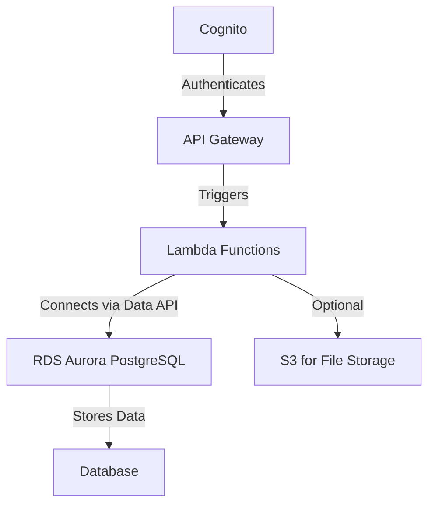

# ParametriksCDK Repository

## 1. What is AWS CDK?

The **AWS Cloud Development Kit (CDK)** is an open-source software development framework for defining cloud infrastructure using programming languages such as Python, TypeScript, Java, and more. AWS CDK provides a high-level, object-oriented abstraction for AWS resources, enabling developers to define infrastructure as code (IaC) and deploy it using AWS CloudFormation.

### **Key Features of AWS CDK:**

- Write infrastructure code in familiar programming languages.
- Leverage reusable constructs to model and provision AWS resources.
- Seamless integration with AWS CloudFormation.
- Supports best practices with built-in validations and constructs.

## 2. How to Use This CDK

### Prerequisites:

- Install Node.js and npm.
- Install AWS CLI and configure it with the correct credentials and region.
- Install AWS CDK: `npm install -g aws-cdk`.
- Create a Python virtual environment and install dependencies.

### Steps:

1. **Clone the Repository:**

   ```bash
   git clone <repository-url>
   cd <repository-name>
   ```

2. **Activate the Python Environment:**

   ```bash
   python3 -m venv .venv
   source .venv/bin/activate
   pip install -r requirements.txt
   ```

3. **Synthesize the CloudFormation Template:**

   ```bash
   cdk synth
   ```

4. **Deploy All Stacks:**

   ```bash
   cdk deploy --all
   ```

5. **Destroy All Stacks (when no longer needed):**
   ```bash
   cdk destroy --all
   ```

## 3. Services Used in This Repository

This repository uses the following AWS services:

### Core Services:

- **VPC:** Provides networking resources such as subnets, route tables, and NAT gateways.
- **RDS (Aurora PostgreSQL):** Serverless Aurora PostgreSQL database with Data API enabled.
- **Lambda:** Serverless compute for running Python scripts to interact with RDS and manage APIs.
- **API Gateway:** Exposes RESTful APIs for interaction with Lambda functions.
- **Cognito:** Provides user authentication and authorization for insurers and clients.

### Supporting Services:

- **IAM:** Manages permissions and roles for AWS resources.
- **CloudFormation:** Manages the underlying stack deployment.

## 4. AWS Service Map for This CDK



## 5. Repository Tree and Structure

```
.
├── README.md
├── app.py
├── cdk.json
├── requirements.txt
├── parametriks_cdk
│   ├── __init__.py
│   ├── vpc_stack.py
│   ├── rds_stack.py
│   ├── lambda_stack.py
│   ├── api_gateway_stack.py
│   ├── cognito_stack.py
│   └── parametriks_app.py
├── lambdas
│   ├── setup_schema.py
│   ├── get_companies.py
│   └── dynamic_table_query.py
└── tests
    └── test_parametriks_cdk_stack.py
```

### Key Files and Folders:

- **`app.py`:** Entry point for CDK application. Defines and synthesizes all stacks.
- **`parametriks_cdk`:** Contains modular Python files for each stack:
  - `vpc_stack.py`: Configures the VPC and networking resources.
  - `rds_stack.py`: Configures the Aurora PostgreSQL serverless database.
  - `lambda_stack.py`: Configures Lambda functions for API and database interaction.
  - `api_gateway_stack.py`: Configures API Gateway for exposing Lambda functions.
  - `cognito_stack.py`: Configures AWS Cognito for user authentication.
  - `parametriks_app.py`: Orchestrates and deploys all stacks.
- **`lambdas`:** Python code for Lambda functions.
  - `setup_schema.py`: Initializes database schema.
  - `get_companies.py`: Fetches company data.
  - `dynamic_table_query.py`: Executes dynamic queries based on user input.

## 6. Explain and Breakdown the Python Codes

### **`vpc_stack.py`**

Defines a VPC with public and private subnets, route tables, and a NAT gateway.

```python
vpc = ec2.Vpc(
    self,
    "ParametriksVpc",
    max_azs=2,
    nat_gateways=1,
)
```

### **`rds_stack.py`**

Defines an Aurora PostgreSQL serverless cluster with Data API enabled.

```python
self.cluster = rds.DatabaseCluster(
    self,
    "ParametriksServerlessCluster2",
    engine=rds.DatabaseClusterEngine.aurora_postgres(
        version=rds.AuroraPostgresEngineVersion.VER_16_1
    ),
    writer=rds.ClusterInstance.serverless_v2("writer"),
    serverless_v2_min_capacity=0.5,
    serverless_v2_max_capacity=8.0,
    default_database_name="dev",
    enable_data_api=True,
)
```

### **`lambda_stack.py`**

Creates Lambda functions and grants them permissions to interact with RDS via the Data API.

```python
setup_schema_lambda = _lambda.Function(
    self,
    "SetupSchemaLambda",
    runtime=_lambda.Runtime.PYTHON_3_9,
    code=_lambda.Code.from_asset("lambdas"),
    handler="setup_schema.handler",
    environment={
        "DB_CLUSTER_ARN": db_cluster_arn,
        "DB_SECRET_ARN": db_secret_arn,
        "DB_NAME": db_name,
    },
)
```

### **`api_gateway_stack.py`**

Configures API Gateway to expose endpoints for Lambda functions.

```python
api = apigw.RestApi(
    self,
    "ParametriksApi",
    rest_api_name="Parametriks API",
)
companies = api.root.add_resource("companies")
companies.add_method("GET", apigw.LambdaIntegration(get_companies_lambda))
```

### **`cognito_stack.py`**

Creates a Cognito user pool for user authentication.

```python
user_pool = cognito.UserPool(
    self,
    "ParametriksUserPool",
    self_sign_up_enabled=True,
    sign_in_aliases=cognito.SignInAliases(username=True, email=True),
)
```

### **Lambda Functions**:

#### **`setup_schema.py`**

Creates database tables if they do not already exist.

```python
SQL_CREATE_DATABASE = f"CREATE DATABASE IF NOT EXISTS {DB_NAME};"
SQL_SCHEMA = "..."
```

#### **`get_companies.py`**

Fetches all companies from the database.

```python
def handler(event, context):
    response = rds_data.execute_statement(...)
    return {"statusCode": 200, "body": json.dumps(response)}
```

#### **`dynamic_table_query.py`**

Executes SQL queries dynamically based on API request headers.

```python
def handler(event, context):
    table_name = event["headers"].get("Table-Name")
    query = f"SELECT * FROM {table_name} LIMIT 10;"
```

## Conclusion

This repository implements a robust, modular AWS infrastructure using CDK. It enables efficient setup of serverless architectures for data management and API interaction while ensuring scalability and maintainability.
