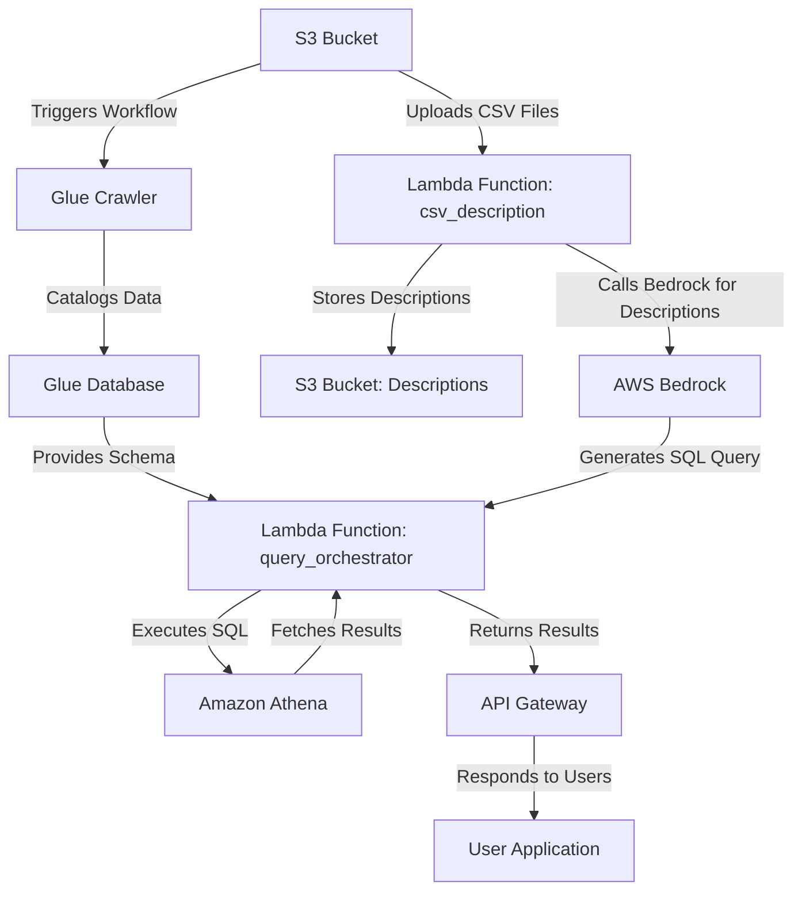

# ParametriksCDK-Extra Repository

## 1. What is AWS CDK?

The **AWS Cloud Development Kit (CDK)** is an open-source software development framework for defining cloud infrastructure using programming languages such as Python, TypeScript, Java, and more. AWS CDK provides a high-level, object-oriented abstraction for AWS resources, enabling developers to define infrastructure as code (IaC) and deploy it using AWS CloudFormation.

### **Key Features of AWS CDK:**

- Write infrastructure code in familiar programming languages.
- Leverage reusable constructs to model and provision AWS resources.
- Seamless integration with AWS CloudFormation.
- Supports best practices with built-in validations and constructs.

## 2. How to Use This CDK

### **Prerequisites**

1. Install Node.js (for AWS CDK CLI).
2. Install the AWS CDK CLI:

   ```bash
   npm install -g aws-cdk
   ```

3. Ensure Python 3.9+ is installed.
4. Set up AWS CLI credentials for deployment.

### **Setup Instructions**

1. Clone the repository:

   ```bash
   git clone <repository-url>
   cd <repository-folder>
   ```

2. Install Python dependencies:

   ```bash
   pip install -r requirements.txt
   ```

3. Bootstrap your AWS environment (if deploying for the first time):

   ```bash
   cdk bootstrap
   ```

4. Synthesize the CDK application:

   ```bash
   cdk synth
   ```

5. Deploy the stack:

   ```bash
   cdk deploy
   ```

6. Clean up resources (optional):

   ```bash
   cdk destroy
   ```

---

## 3. What Are the Services Used Here?

This CDK application leverages several AWS services to build a scalable and intelligent data pipeline:

1. **Amazon S3**: Stores CSV files and generated descriptions. Triggers workflows upon file uploads.
2. **AWS Glue**: Crawls and catalogs data schemas from S3.
3. **AWS Bedrock**: Provides AI-based insights and SQL generation using foundation models.
4. **Amazon Athena**: Executes SQL queries to analyze data stored in S3.
5. **AWS Lambda**: Processes data, triggers workflows, generates descriptions, and orchestrates queries.
6. **Amazon API Gateway**: Exposes a REST API for querying and interacting with the data pipeline.



---

## 4. AWS Service Map for This CDK

The following diagram illustrates the interaction between AWS services in this application:

1. **Data Upload**:

   - CSV files are uploaded to S3.
   - S3 triggers a Lambda function to initiate workflows.

2. **Data Crawling**:

   - The Lambda triggers an AWS Glue crawler.
   - Glue crawler catalogs the uploaded data.

3. **Metadata Generation**:

   - The metadata (headers) extracted by Glue is processed by a Lambda function.
   - AWS Bedrock generates descriptions for the data.

4. **Query Orchestration**:
   - API Gateway allows users to send queries.
   - Lambda handles query classification and SQL generation (via Bedrock).
   - Athena executes the SQL and returns results.

---

## 5. Repository Tree and Structure

```plaintext
.
├── README.md          # Project documentation
├── app.py             # Entry point for CDK application
├── cdk.json           # CDK configuration file
├── requirements.txt   # Python dependencies
├── lambdas/           # Lambda function directories
│   ├── csv_description/  # Handles CSV description generation
│   │   └── description_handler.py
│   └── query_orchestrator/ # Handles query orchestration
│       └── handler.py
├── parametriks_cdk_extra/
│   ├── __init__.py
│   └── parametriks_cdk_extra_stack.py # CDK stack definition
├── tests/             # Unit tests for the application
│   └── test_parametriks_cdk_extra_stack.py
```

---

## 6. Explain and Breakdown the Python Codes

### **app.py**

The `app.py` file serves as the entry point for the AWS CDK application. It initializes the `ParametriksCDKExtraStack` and deploys all the AWS resources defined in that stack. This file contains minimal logic but is essential for connecting the application to AWS infrastructure. For example:

```python
from aws_cdk import App
from parametriks_cdk_extra.parametriks_cdk_extra_stack import ParametriksCDKExtraStack

app = App()
ParametriksCDKExtraStack(app, "ParametriksCDKExtraStack")
app.synth()
```

- **Key Functions**: Initializes the CDK stack and synthesizes it into AWS CloudFormation templates.

### **parametriks_cdk_extra_stack.py**

This file defines the entire infrastructure as code (IaC) for the application. It is where AWS services like S3, Glue, Athena, Lambda, and API Gateway are configured and connected.

#### **Key Components**

1. **S3 Bucket**:

   ```python
   self.data_bucket = s3.Bucket(
       self,
       "GenAIDataBucket",
       removal_policy=RemovalPolicy.DESTROY,
       auto_delete_objects=True,
   )
   ```

   - Stores uploaded CSV files.
   - Triggers workflows upon new file uploads.

2. **Glue Database and Crawler**:

   ```python
   self.glue_database = glue.CfnDatabase(
       self,
       "GenAIDatabase",
       catalog_id=self.account,
       database_input=glue.CfnDatabase.DatabaseInputProperty(name="gen_ai_db"),
   )

   self.glue_crawler = glue.CfnCrawler(
       self,
       "GenAICrawler",
       role=crawler_role.role_arn,
       database_name=self.glue_database.ref,
       targets=glue.CfnCrawler.TargetsProperty(
           s3_targets=[
               glue.CfnCrawler.S3TargetProperty(
                   path=f"s3://{self.data_bucket.bucket_name}/csv"
               )
           ]
       ),
       name="gen-ai-crawler",
   )
   ```

   - **Glue Database**: Catalogs the uploaded data schemas.
   - **Glue Crawler**: Dynamically updates the database schema when new data is uploaded to S3.

3. **Lambda Functions**:

   - **`csv_description`**: Generates descriptions for CSV files using AWS Bedrock. The Lambda is triggered upon file uploads.
   - **`query_orchestrator`**: Handles user queries by classifying them, generating SQL using Bedrock, and executing it in Athena.

4. **Athena WorkGroup**:

   ```python
   self.athena_workgroup = athena.CfnWorkGroup(
       self,
       "GenAIWorkGroup",
       name="gen_ai_workgroup",
       work_group_configuration=athena.CfnWorkGroup.WorkGroupConfigurationProperty(
           publish_cloud_watch_metrics_enabled=True,
           enforce_work_group_configuration=False,
       ),
   )
   ```

   - Executes SQL queries generated by the orchestrator Lambda.

5. **API Gateway**:

   ```python
   api = apigateway.RestApi(
       self,
       "QueryAPI",
       rest_api_name="Query Execution API",
       description="API to execute user queries and retrieve results.",
   )
   ```

   - Exposes a REST API for users to interact with the system.

### **description_handler.py**

This Lambda function is triggered whenever a new CSV file is uploaded to the S3 bucket. It performs the following steps:

1. **Fetch Table Schema**:
   Retrieves headers (columns) from the Glue catalog:

   ```python
   response = glue_client.get_table(DatabaseName=database_name, Name=table_name)
   columns = response["Table"]["StorageDescriptor"]["Columns"]
   headers = [col["Name"] for col in columns]
   ```

2. **Generate Descriptions Using Bedrock**:
   Calls AWS Bedrock to generate human-readable descriptions of the dataset based on the headers:

   ```python
   bedrock_response = bedrock_client.invoke_model(
       modelId=os.environ.get("BEDROCK_MODEL_ID"),
       contentType="application/json",
       accept="application/json",
       body=json.dumps({
           "messages": [{"role": "user", "content": [{"type": "text", "text": prompt}]}],
           "max_tokens": 150,
           "temperature": 0.7
       })
   )
   ```

3. **Store Descriptions in S3**:
   Saves the generated description as a text file:

   ```python
   s3_client.put_object(
       Bucket=bucket_name,
       Key=description_key,
       Body=generated_description,
       ContentType="text/plain"
   )
   ```

### **handler.py**

This Lambda function handles query orchestration. It:

1. **Classifies Queries**:
   Uses AWS Bedrock to determine if a query is general or data-related:

   ```python
   classification_prompt = (
       f"Classify this query as 'general' or 'data-related': {user_question}"
   )
   response = bedrock_client.invoke_model(...)
   ```

2. **Processes General Queries**:
   If the query is not data-related, it generates a general response:

   ```python
   general_response_prompt = (
       f"Answer this general question: {user_question}"
   )
   response = bedrock_client.invoke_model(...)
   ```

3. **Generates and Executes SQL for Data Queries**:

   - **SQL Generation**: Creates an SQL query using Bedrock.
   - **Athena Execution**: Executes the SQL query in Athena and retrieves results.

   ```python
   query_response = athena_client.start_query_execution(
       QueryString=generated_sql,
       QueryExecutionContext={"Database": database_name},
       ResultConfiguration={"OutputLocation": output_location},
   )
   ```

4. **Formats Results**:
   Converts Athena results into a natural language response using Bedrock.

### **Tests**

Located in the `tests/` directory, these tests verify:

- The stack resources are correctly defined.
- Lambda functions work as intended.
- Integration between services like S3, Glue, and Athena operates as expected.

---

## Final Notes

This repository demonstrates the integration of multiple AWS services to build a scalable and intelligent data pipeline. Use this documentation to understand, extend, or customize the application for your specific needs. Let me know if additional clarifications are required!
