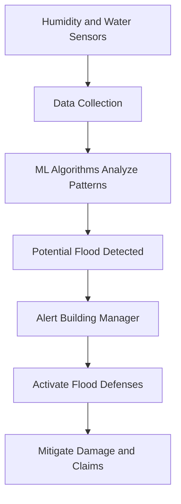
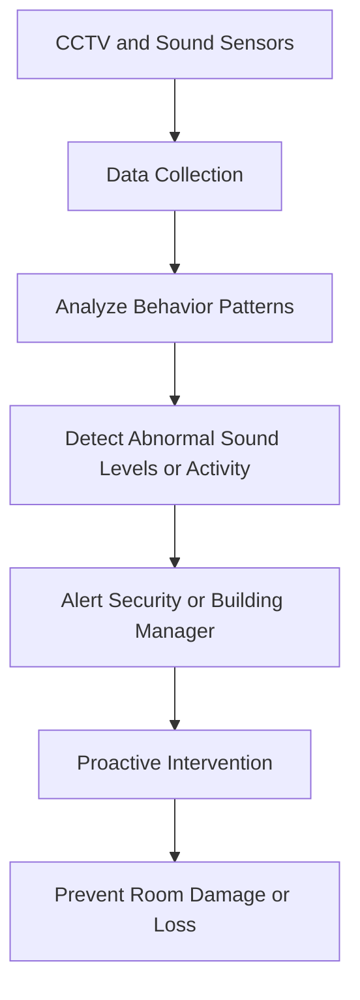
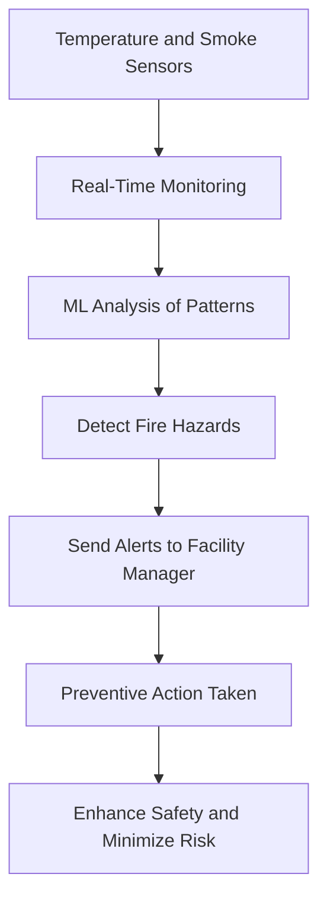
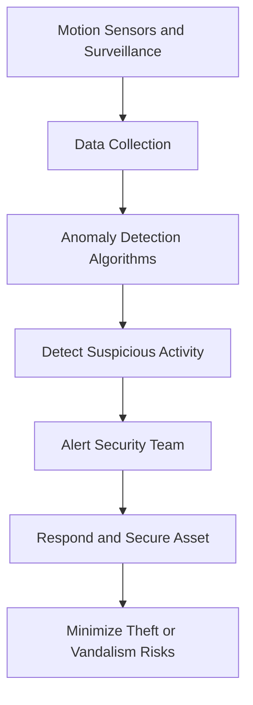

# Parametriks in Action – Use Cases and Scenarios

Parametriks leverages IoT, machine learning, and predictive analytics to provide insurers with real-time insights and proactive risk mitigation tools. Below are key scenarios demonstrating how Parametriks’ technology addresses specific challenges faced by insurers and insured clients, resulting in lower premiums, reduced claims, and a safer operational environment.

## The Problem: Status Quo

Insurance companies traditionally rely on historical data to assess risks, which often results in slow and reactive responses to claims. Current limitations include:

- **Lack of Live Data**: Without access to real-time operational data, insurers cannot accurately assess immediate risk.
- **Claims-Centric Approach**: Insurers typically wait for claims to be filed to understand risks, which can increase financial losses due to delays in response.
- **Erosion of Market Share**: Clients demand faster, more agile responses. Insurers that cannot provide proactive risk management solutions lose market relevance and competitiveness.

Parametriks shifts this paradigm by integrating real-time data and predictive algorithms, allowing insurers and clients to prevent incidents and optimize premium pricing.

## Scenario Summary Table

| **Scenario**                                      | **Challenge**                                | **Solution**                    | **Technology Used**              | **Impact**                                                |
| ------------------------------------------------- | -------------------------------------------- | ------------------------------- | -------------------------------- | --------------------------------------------------------- |
| Flood Detection in Commercial Buildings           | High-cost flood risks                        | Predictive flood alerts         | IoT Sensors, ML                  | Damage and claims reduction, premium discounts            |
| Mitigating Dangerous Behavior                     | High-traffic area incidents                  | Behavioral monitoring           | CCTV, Sound Sensors              | Prevention of damage and downtime, operational continuity |
| Accurate Pricing for Captives                     | Need for accurate risk-based pricing         | Automated data analysis         | AI, Actuarial Algorithms         | Improved pricing accuracy and time savings                |
| Predicting Fire Risks in Educational Institutions | Fire risks in large campuses                 | Environmental sensor monitoring | Temperature, Smoke Sensors       | Enhanced safety, reduced likelihood of fire damage        |
| Multi-Year Client Data Analysis                   | Long analysis times for brokers and insurers | GenAI for trend analysis        | General AI, Statistical Analysis | Streamlined workflows, enhanced policy management         |
| Anomaly Detection for High-Value Assets           | Theft/vandalism risks for high-value assets  | Anomaly detection and alerting  | Motion Sensors, CCTV             | Asset protection, minimized claim payouts                 |

## Scenario 1: Flood Detection in Commercial Buildings

### Challenge

Flooding is one of the most costly risks for property insurers, leading to significant repair costs and operational disruptions. Detecting potential flood risks early is critical to mitigate damage.

### Solution

Parametriks’ platform uses environmental sensors (e.g., humidity and water level sensors) to monitor moisture and water presence in sensitive areas. Machine learning algorithms analyze these readings in real-time, detecting patterns that indicate a potential flood.

### Impact

- **Client Response**: Building manager receives alerts and enacts flood defenses before critical water levels are reached.
- **Outcome**: Damage and costly claims are avoided, and operations are minimally disrupted.
- **Insurance Benefit**: Insurers recognize the reduced risk and offer a lower premium, acknowledging the client’s proactive risk management.

## Scenario 2: Mitigating Dangerous Behavior in High-Traffic Areas

### Challenge

Large properties such as hotels and casinos are prone to incidents related to overcrowding or unsafe behaviors, leading to room damage, high-payout claims, and potential operating loss.

### Solution

Parametriks integrates with CCTV and sound-level sensors to monitor high-traffic areas. Algorithms detect behavior patterns or sound levels indicative of potentially dangerous situations, triggering early alerts.

### Impact

- **Client Response**: Security or building management receives an alert and addresses the issue before damage occurs.
- **Outcome**: Room remains operational with minimal downtime, and significant damage is prevented.
- **Insurance Benefit**: Reduced risk of claims related to operating loss or repairs, resulting in a lower premium for the client.

## Scenario 3: Accurate Pricing for Captives and Risk Managers

### Challenge

Accurate premium pricing is essential for insurance captives, but traditional methods often rely on historical data and actuarial assumptions. This approach can result in inaccurate pricing for clients with unique risk profiles.

### Solution

Parametriks’ AI platform instantly analyzes historical claims data, policy evolution, and specific client risk factors to deliver accurate, data-driven premium pricing.

### Impact

| **Parameter**       | **Traditional Approach**        | **Parametriks Solution**               |
| ------------------- | ------------------------------- | -------------------------------------- |
| Time Required       | Several hours to days           | Instant, real-time                     |
| Pricing Accuracy    | Based on historical assumptions | Based on real-time and contextual data |
| Client Satisfaction | Moderate                        | High, due to transparency and accuracy |

---

## Scenario 4: Predicting Fire Risks in Educational Institutions

### Challenge

Educational institutions, especially large campuses, face fire risks that are exacerbated by equipment malfunction or environmental factors. Proactively addressing these risks can protect lives and property.

### Solution

Parametriks’ platform uses temperature, smoke, and environmental sensors across campuses to monitor conditions in real-time. Machine learning algorithms analyze data patterns to detect abnormalities and predict the likelihood of fire hazards.

### Impact

- **Client Response**: Facility managers are alerted to potential fire risks, enabling preventive action (e.g., equipment checks or evacuation).
- **Outcome**: Reduced likelihood of fire damage and enhanced safety for students and staff.
- **Insurance Benefit**: Lower claim rates and safer environments contribute to reduced premiums and stronger client-insurer relationships.

## Scenario 5: Rapid Analysis of Multi-Year Client Data for Brokers and Insurers

### Challenge

Brokers, MGAs, and insurers often need a quick assessment of client risk factors over multiple years to adjust policy terms or analyze performance. Manual data analysis can be time-consuming and prone to inaccuracies.

### Solution

Parametriks’ General AI feature, trained on client data, instantly analyzes multiple years of historical data to identify patterns, track client evolution, and determine risk factors.

### Impact

| **Factor**                      | **Manual Analysis**  | **GenAI Analysis**           |
| ------------------------------- | -------------------- | ---------------------------- |
| Time to Analyze                 | Days to weeks        | Minutes                      |
| Data Consistency                | Prone to human error | Consistent and automated     |
| Insights for Policy Adjustments | Limited              | Comprehensive and actionable |

## Scenario 6: Anomaly Detection for High-Value Assets

### Challenge

Properties with high-value assets, such as art galleries or luxury hotels, are vulnerable to unique risks such as theft or vandalism, which require customized risk management.

### Solution

Parametriks deploys advanced anomaly detection algorithms on data from surveillance cameras and motion sensors, identifying unusual activity and triggering alerts to on-site security teams.

### Impact

- **Client Response**: Security teams receive immediate alerts and can respond proactively, minimizing the likelihood of asset damage or theft.
- **Outcome**: High-value assets are protected, and operational costs related to asset loss are minimized.
- **Insurance Benefit**: Reduced claim payouts related to theft or vandalism, contributing to better risk profiling and client satisfaction.
