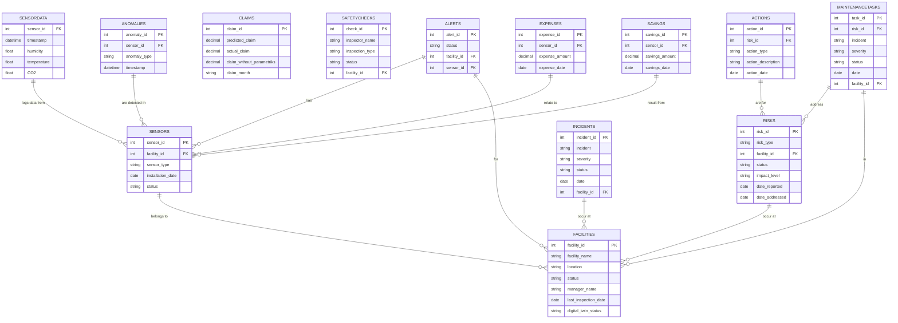

# Database Relational Diagram

```mermaid
erDiagram
    SENSORS {
        int sensor_id PK
        int facility_id FK
        string sensor_type
        date installation_date
        string status
    }

    FACILITIES {
        int facility_id PK
        string facility_name
        string location
        string status
        string manager_name
        date last_inspection_date
        string digital_twin_status
    }

    ALERTS {
        int alert_id PK
        string status
        int facility_id FK
        int sensor_id FK
    }

    RISKS {
        int risk_id PK
        string risk_type
        int facility_id FK
        string status
        string impact_level
        date date_reported
        date date_addressed
    }

    ACTIONS {
        int action_id PK
        int risk_id FK
        string action_type
        string action_description
        date action_date
    }

    CLAIMS {
        int claim_id PK
        decimal predicted_claim
        decimal actual_claim
        decimal claim_without_parametriks
        string claim_month
    }

    SAFETYCHECKS {
        int check_id PK
        string inspector_name
        string inspection_type
        string status
        int facility_id FK
    }

    MAINTENANCETASKS {
        int task_id PK
        int risk_id FK
        string incident
        string severity
        string status
        date date
        int facility_id FK
    }

    INCIDENTS {
        int incident_id PK
        string incident
        string severity
        string status
        date date
        int facility_id FK
    }

    SENSORDATA {
        int sensor_id FK
        datetime timestamp
        float humidity
        float temperature
        float CO2
    }

    ANOMALIES {
        int anomaly_id PK
        int sensor_id FK
        string anomaly_type
        datetime timestamp
    }

    EXPENSES {
        int expense_id PK
        int sensor_id FK
        decimal expense_amount
        date expense_date
    }

    SAVINGS {
        int savings_id PK
        int sensor_id FK
        decimal savings_amount
        date savings_date
    }

    SENSORS ||--o{ FACILITIES : "belongs to"
    ALERTS ||--o{ SENSORS : "has"
    ALERTS ||--o{ FACILITIES : "for"
    RISKS ||--o{ FACILITIES : "occur at"
    ACTIONS ||--o{ RISKS : "are for"
    MAINTENANCETASKS ||--o{ RISKS : "address"
    MAINTENANCETASKS ||--o{ FACILITIES : "in"
    INCIDENTS ||--o{ FACILITIES : "occur at"
    SENSORDATA ||--o{ SENSORS : "logs data from"
    ANOMALIES ||--o{ SENSORS : "are detected in"
    EXPENSES ||--o{ SENSORS : "relate to"
    SAVINGS ||--o{ SENSORS : "result from"
```
